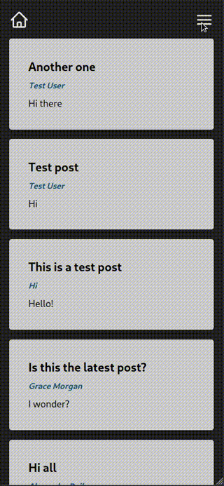
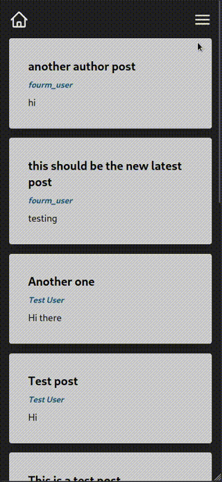
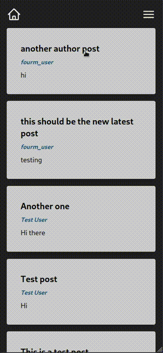
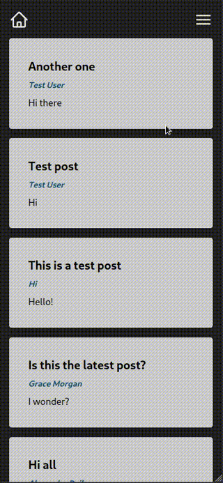
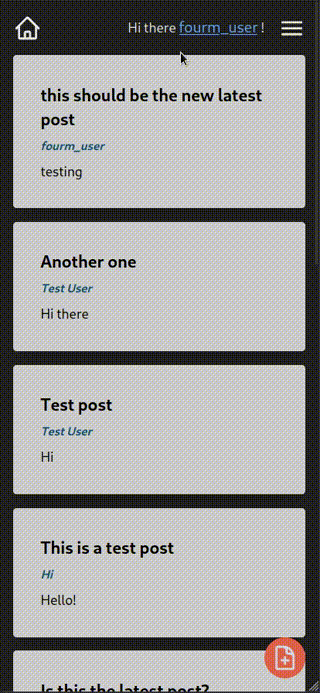
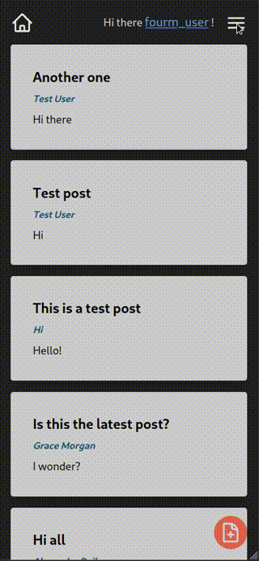

# TVfourm
Fourm/Microblogging website written in V and Tailwind with Zero JS

## 🌟 Features

✅ **No JavaScript**: Yes, you read that right! This project proudly embraces the power of V and Tailwind to create a dynamic web experience without relying on any JavaScript.

🔐 **User Authentication**: Enjoy the convenience of user authentication. Our project supports full user state, including login and signup modals, to ensure your users' data is safe.

📝 **Posts Galore**: Say hello to posts! Each post comes with a title and body. Users can create their posts, all while enjoying a seamless browsing experience.

🧑‍🤝‍🧑 **User-Centric**: We prioritize user experience! Every user's state and data are stored independently, providing a personalized journey through the webapp.

📜 **Pagination Magic**: The home page is designed for efficiency. With pagination, users can explore a bite-sized portion of the total content with each page load.

## 📸 Screenshots

| Signup Flow | Input Validation | Like Authorization |
| -- | -- | -- |
|  |  |  |

|  Pagenation  | Author Posts |Latest Post|
| -- | -- | -- |
|  |  |  |

## 🚀 Getting Started

1. Clone this repository to your local machine.
2. Set up your development environment with V and Tailwind.
3. Customize the app as you see fit, modifying the templates, styles, and user interactions.

## 🛠️ Installation

Follow these steps to run the project locally:

1. Install V: [V Installation Guide](https://vlang.io/docs)
2. Install Tailwind: [Tailwind CSS Installation Guide](https://tailwindcss.com/docs/installation)
3. Clone this repository: `git clone https://github.com/jacksonmowry/TVfourm.git`
4. Navigate to the project folder: `cd TVfourm/src`
5. Launch the V development server: `v run .`

## 🎉 Contribution

We welcome contributions to make this project even more amazing! Feel free to fork the repository and submit pull requests.

## 📝 License

This project is licensed under the [MIT License](LICENSE).

---

Thank you for checking out TVfourm! If you have any questions or feedback, don't hesitate to post an issue.
